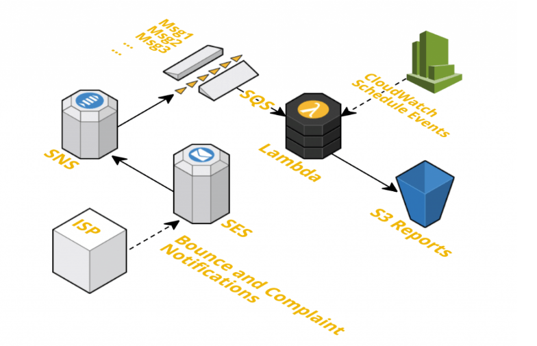

# AWS SES Report

**Simple Dashboard for AWS SES (Simple Email Service) to track deliveries, bounces and complaints mails.**

Currently it only contains the lambda function code in order to create a dashboard. Please take a look at the roadmap section.

Dashboard looks like :

AWS resources you need to get this dashboard working :

## Roadmap

- create a terraform module that creates the mandatories AWS resources in one-shot (such as SES, SNS, SQS, Lambda, S3 bucket and Cloudwatch Schedule Event).

## Thanks

- Idea : https://aws.amazon.com/blogs/ses/creating-a-daily-dashboard-to-track-bounces-and-complaints/
- Nodejs code : https://github.com/Morning-Train/AWS-SES-Report
